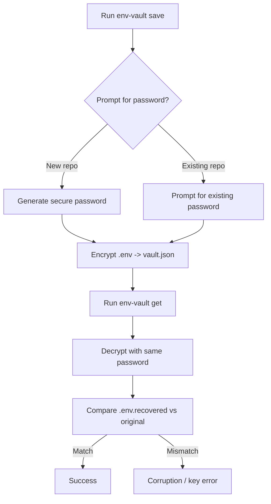
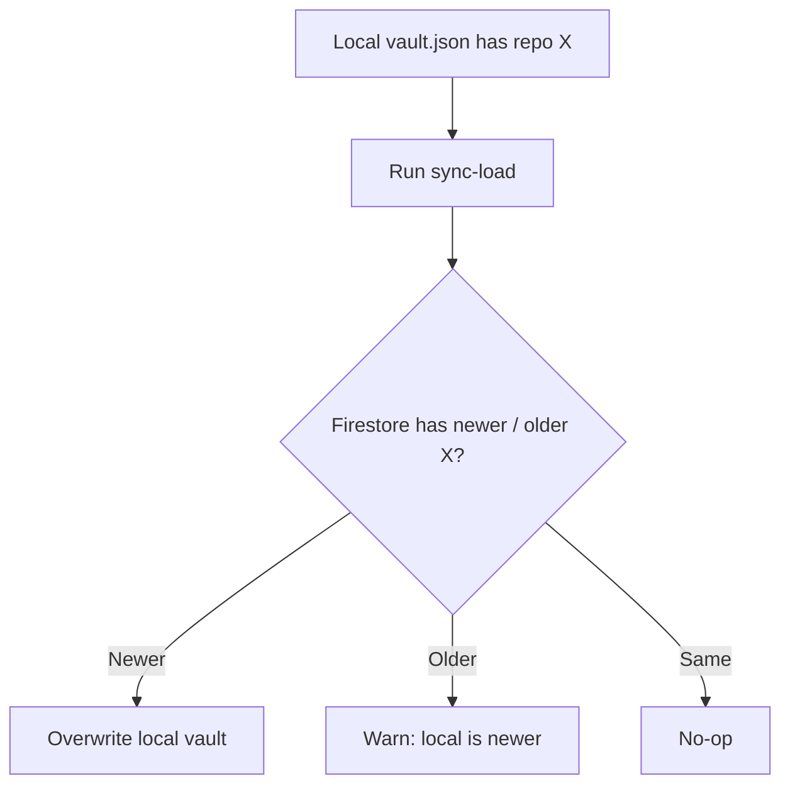
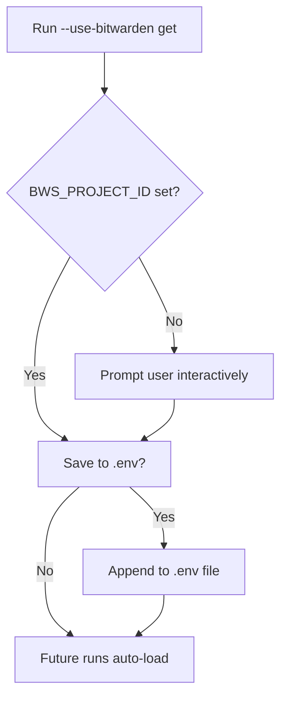

# env-vault flows

## Save / get flow

```mermaid
flowchart TD
  A[Run env-vault save] --> B{Prompt for password?}
  B -->|New repo| C[Generate secure password]
  B -->|Existing repo| D[Prompt for existing password]
  C --> E[Encrypt .env -> vault.json]
  D --> E
  E --> F[Run env-vault get]
  F --> G[Decrypt with same password]
  G --> H[Compare .env.recovered vs original]
  H -->|Match| I[Success]
  H -->|Mismatch| J[Corruption / key error]
```

## sync-load flow

```mermaid
flowchart TD
  A[Local vault.json has repo X] --> B[Run sync-load]
  B --> C{Firestore has newer / older X?}
  C -->|Newer| D[Overwrite local vault]
  C -->|Older| E[Warn: local is newer]
  C -->|Same| F[No-op]
```

## Bitwarden get flow

```mermaid
flowchart TD
  A[Run --use-bitwarden get] --> B{BWS_PROJECT_ID set?}
  B -->|No| C[Prompt user interactively]
  B -->|Yes| D[Save to .env?]
  C --> D
  D -->|Yes| E[Append to .env file]
  D -->|No| F[Future runs auto-load]
  E --> F
```
